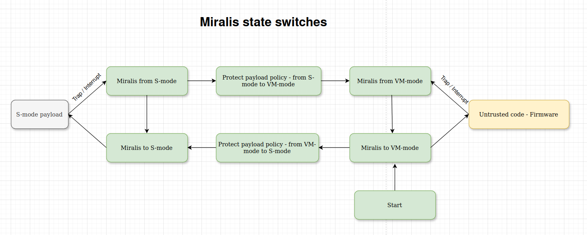
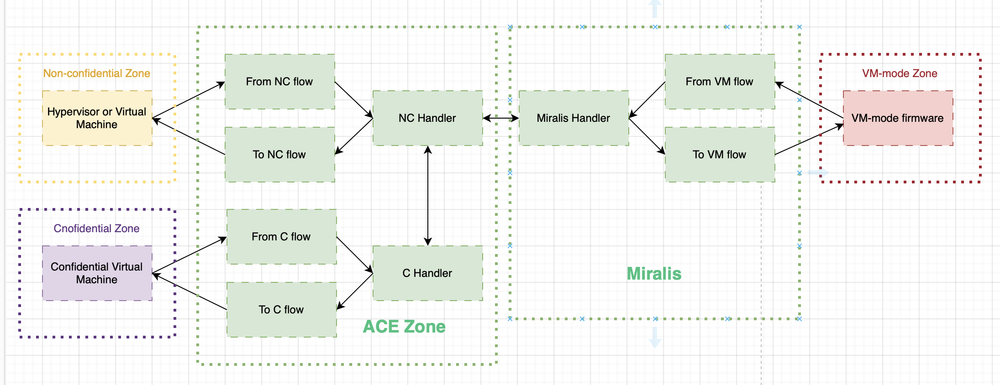

# Protection Policies

## General concept

Running firmware in a dedicated VM is not enough and simply protect Miralis from it is not enough to exclude it from the TCB. Although it lacks M-mode access, it can still compromise the OS by altering memory segments, leading to potential attacks like code injection or unauthorized memory access. Sensitive data, such as cryptographic keys, could be exposed. To address these risks, robust security policies are needed. This deocument introduces the concept of security policy, which is a framework that allows the user to enforce custom security invariants on top of Miralis.
### State Transitions

The following diagram illustrates the state transitions in our model:



On a single core, transitions are transactional and happen in a total order.

### Properties

**Property 0: VM-mode** has the same right as any unpriviledge userspace program.

*Proof:*  
The proof is trivial
---

**Property 1: VM-mode** The `policy.from_payload_to_firmware` will be called between any transitions from the payload to the firmware and can set the system in any state

*Proof:*  
The state transitions above shows us that it is impossible to jump from one to the other without passing through this logical state.
---

**Property 2: VM-mode** The `policy.from_firmware_to_payload` function can accurately restore the registers and mark the payload's memory as accessible.

*Proof:*  
Proof is analogous to property 1
---

**Property 3: The untrusted code runs in VM-mode.**

*Proof:*  
Miralis runs the firmware in VM-mode and the userspace can't give himself the priviledges.

---

**Property 4: While loading the Payload, the firmware can't put the OS in a compromised state**

Note that we must transit between Miralis on a jump from the Firmware to the Payload. Therefore, Miralis can implement a secure boot mechanism that will only run the S-mode payload if it satisfies the conditions required by this secure boot. 

**Property 5: Miralis, traps are disabled**

*Proof:*
Miralis disables the interrupts in M-mode and any trap in M-mode make the program panic.

---

### Formal Definitions

A **payload state** is defined as a tuple $S = (\text{memory}, \text{general purpose registers}, \text{csr registers})$, where:
- `memory` is an ordered set representing memory locations,
- `general purpose and floating point registers` is an ordered set of 32 general-purpose registers,
- `csr registers` is an ordered set of control and status registers (CSRs).
- `pc` corresponds to the program counter.

Two payload states are equivalent if and only if:
- $\text{memory}_1 \equiv \text{memory}_2$,
- $\text{gp}_1 \equiv \text{gp}_2 $, and
- $\text{csr}_1 \equiv \text{csr}_2$.

### Assumptions

Regarding the 

- Miralis is a trusted component and is free of bugs.
- Side-channel attacks are out of scope.
- The underlying hardware is trusted and behaves correctly.
- The firmware does not alter the set of CSR registers and Miralis enforces interrupt delegation to S-mode.
- Miralis is running on a single core at the moment


## Protect payload policy

### Threat Model

In this scenario, the threat comes from the firmware, which has the ability to execute arbitrary code, trigger interrupts, and potentially read or modify payload memory. As per our assumptions, side-channel attacks, transient execution vulnerabilities, and CPU bugs are considered out of scope. Finally, we place trust in Miralis and assume it to be free of bugs.

### Guarantees

The strict payload policy ensures two key guarantees:

1. **Confidentiality:** The firmware cannot leak any information from the payload. This ensures that the execution of the payload remains secret to the firmware.

2. **Integrity:** The firmware cannot alter the architectural state of the payload in any way.

### Expected architectural transitions per interrupts / traps - wip

#### Interrupts

TODO: Formally decide which guarantees we want to bring in the case of multple interrupts.

- Machine software interup: equivalent state
- Machine timer interrupt: equivalent state
- Machine external interrupt: equivalent state

- Supervisor software interupt: out of scope
- Supervisor timer interrupt: out of scope
- Supervisor external interrupt: out of scope

#### Traps

- Instruction address misaligned: stop execution? - todo: discuss with Charly & Ed
- Instruction access fault: stop execution? - todo: discuss with Charly & Ed
- Illegal instruction: pc += 4, 
- Breakpoint: equivalent state 
- Load address misaligned: stop execution? - todo: discuss with Charly & Ed
- Load access fault: stop execution? - todo: discuss with Charly & Ed
- Store/AMO address misaligned: stop execution? - todo: discuss with Charly & Ed
- Ecall from S-mode: pc += 4, registers a0-a7 can be leaked, state of registers a0-a1 is volatile
- Instruction page fault: delegated to the Payload
- Load page fault: delegated to the Payload
- Store/AMO page fault: delegated to the payload

### Security guarantee 1: The Firmware Cannot Leak Information from the S-mode Payload - except the source code it loads

There are two potential ways the firmware might try to leak information:
1. By leaking register contents.
2. By reading memory.

We will analyze both cases:

**Case 1: Register leak**  
To read register values, the firmware must have been in S-mode and transitioned to VM-mode. By Lemma 2, this requires invoking `policy.from_payload_to_firmware`. According the second axiom, we clear the registers.

**Case 2: Memory leak**  
To read memory, the firmware must also have transitioned from S-mode to VM-mode. According to Lemma 2, the payload memory is protected by PMP (Physical Memory Protection) entries, rendering the memory inaccessible to the firmware. According to the second axiom, we protect the memory. Finally, traps such as page fault are delegated to the S-mode by Miralis and can be therefore handled properly.

Thus, the firmware cannot leak any information from the S-mode payload.

### Security guarantee 2: The Firmware Cannot Alter the Architectural State of the S-mode Payload

We assume that the firmware cannot alter the payload state before the first transition to S-mode. It remains to prove that leaving S-mode, either through an interrupt or a trap, preserves the payload state.

**Case 1: Interrupt while running the payload**  
According to the transition graph, transitioning from the payload to the firmware follows this sequence:
```
Payload → Miralis → Protect → [Miralis → Firmware → Miralis]* → Protect → Miralis → Payload
```
Before entering the firmware, `policy.from_payload_to_firmware` locks the payload, preventing memory writes, and takes a snapshot of the register state. Before resuming the payload, `policy.from_firmware_to_payload` restores the register state. Therefore, the payload's state remains equivalent before and after the transition. As the untrusted code runs in the deprivileged VM mode, it is unable to modify the transition graph, as ensured by Axiom 0.

**Case 2: Synchronous trap**  
In this case, the trap handler must increment the PC (e.g., by 4) to resume execution. We assume that Miralis handles this correctly, ensuring that the architectural state remains unchanged.

### Security guarantee 3: The Firmware Cannot set the CSR registers in the payload in a non-desired state.

This is a direct implication of the fourth property.

---

## Ace protection policy

Ace is a SM that provides full isolation for confidential workloads while allowing controlled communication between the CVM and hypervisor via shared non-confidential memory pages. This is done through state transformations that restrict information flow to only what's necessary for specific requests. We colocate this security monitor with Miralis which allows us to kick the firmware from the TCB of the confidential virtual machines.

### Axioms introduced by the ace paper

#### A.HW.1
- Hardware provides at least three execution privileges.
- Only the highest privilege level can reconfigure security-critical hardware components.

#### A.HW.2
- Hardware mechanism protects initial boot code from untrusted modifications.
- Processor reset initiates execution of boot code at the highest privilege.

#### A.HW.3
- Memory isolation component blocks access to specific physical memory (confidential memory) from the processor and peripherals.

#### A.HW.4
- Processor can clear all micro-architectural state to remove traces of previous executions.

#### A.HW.5
- Interrupt controller directs interrupts to designated trap handlers and switches context to the appropriate privilege level.
- Only highest privilege level can configure or target interrupts to execute at this level.

#### A.HW.6
- Processor provides an endorsement seed after reset, with a lock to prevent access until the next reset, or a secure external source provides the seed.

#### A.HW.7
- Processor supports atomic memory read and write instructions.

#### A.HW.8
- Processor includes a random number generator or relies on a secure external component for randomness.

### Invariants provided by the ACE security monitor colocated with Miralis

Here’s the complete summary of the invariants, including the **S.Init** invariants along with the **I.Init** and **I.FSM** invariants:

### State Invariants (S.Init)

Following a processor reset and prior to running untrusted code, the security monitor (SM) must take control of the entire computing environment and reconfigure it to ensure its own isolation. Thus, we derive these two initialization invariants.

- **S.Init.1**: No other software or hardware component but the SM can modify the SM’s code or data or modify the security-critical hardware configuration.

*Proof:*  
This is a direct consequent of the second Axiom.

---

- **S.Init.2**: Only the SM can access the endorsement seed and the derived attestation key.

*Proof:*  
This is a direct consequent of the second Axiom.

---

### Initialization Invariants (I.Init)

- **I.Init.1**: The SM executes entirely and exclusively at the highest execution privilege. No other security domains (e.g., hypervisor, CVMs) can execute at this level.

- **I.Init.2**: The memory isolation component controls access to confidential memory, allowing access only to code executing from that memory.

- **I.Init.3**: The code and data of the SM reside entirely in confidential memory.

- **I.Init.4**: The interrupt controller is configured so that all necessary interrupts at the highest execution privilege are handled by the SM.

- **I.Init.5**: Access to the endorsement seed is read and write protected, and the derived attestation key is stored in the control data region.

*Proof:*  


The booting process is similar than the one described in the paper. During the initialization procedure of Miralis, there is call to the routine `PolicyModule::init` that will give the opportunity for Ace to execute its own code.

---

### Runtime Finite State Machine Invariants (I.FSM)

The ACE security monitor (SM) manages state transformations to uphold security guarantees. It consists of three components: the non-confidential (NC) section for hypervisor and VM requests, the Miralis section (MIR) for the Firmware, and the confidential (C) section for requests from confidential virtual machines (CVMs). State sanitization is required for transitions between the NC and C sections to ensure security integrity.



While the SM initially isolates confidential workloads, it can establish shared non-confidential memory for communication between the CVM and hypervisor. State transformations are limited to essential information exchange. The ACE framework includes OpenSBI as part of the trusted computing base. Additionally, we extend the Runtime State Machine Invariants with an invariant that prevents firmware from placing the machine into any arbitrary or illegal state.
- **I.FSM.1**: Both security monitors runs with interrupts disabled, ensuring uninterrupted execution during critical operations.

- **I.FSM.2**: During the transition from non-confidential (NC) to confidential (C), the system:
    1. Reconfigures memory isolation to grant the CVM access to its code and data in confidential memory while restricting access to non-confidential memory unless explicitly requested.
    2. Saves the state and interrupt configuration of the hypervisor or VM.
    3. Reconfigures interrupts to be delivered to the SM.

- **I.FSM.3**: During the transition from C to NC, the system:
    1. Reconfigures memory isolation to deny access to confidential memory.
    2. Restores the state and interrupt configuration saved during the NC to C transition.

- **I.FSM.4**: Entering nodes results in saving the processor state of the security domain in the confidential memory's control data region.

- **I.FSM.5**: Exit nodes clear the micro-architectural state and restore the security domain’s processor state from the confidential memory’s control data region.

- **I.FSM.6**: The architectural state of one security domain is never visible to another security domain, except through a narrowly defined interface for state transformation.

- **I.FSM.7**: The firmware can't corrupt the aforementioned invariants and leak information from Confidential VM.

*Proof (I.FSM.7):*

First, the firmware runs in user space, which has even fewer privileges than the payload. Next, the architectural state modified by the VM-mode firmware can be arbitrarily restricted in Miralis before transitioning to the NC state again, therefore enforcing trust.

---