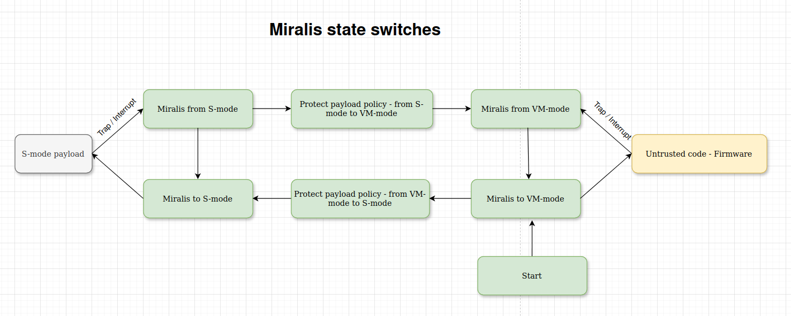

# Security Guarantees of the "Strict Payload Policy"

### Threat Model

In this scenario, the threat comes from the firmware, which has the ability to execute arbitrary code, trigger interrupts, and potentially read or modify payload memory. As per our assumptions, side-channel attacks, transient execution vulnerabilities, and CPU bugs are considered out of scope. Finally, we place trust in Miralis and assume it to be free of bugs.

### Guarantees

The strict payload policy ensures two key guarantees:

1. **Confidentiality:** The firmware cannot leak any information from the payload. This ensures that the execution of the payload remains secret to the firmware.

2. **Integrity:** The firmware cannot alter the architectural state of the payload in any way.

### Assumptions

- Miralis is a trusted component and is free of bugs.
- Side-channel attacks are out of scope.
- The underlying hardware is trusted and behaves correctly.
- The firmware does not alter the set of CSR registers and Miralis enforces interrupt delegation to S-mode.
- Miralis is running on a single core at the moment 

### Formal Definitions

A **payload state** is defined as a tuple $S = (\text{memory}, \text{general purpose registers}, \text{csr registers})$, where:
- `memory` is an ordered set representing memory locations,
- `general purpose registers` is an ordered set of 32 general-purpose registers,
- `csr registers` is an ordered set of control and status registers (CSRs).

Two payload states are equivalent if and only if:
- $\text{memory}_1 \equiv \text{memory}_2$,
- $\text{gp}_1 \equiv \text{gp}_2 $, and
- $\text{csr}_1 \equiv \text{csr}_2$.

### Expected architectural transitions per interrupts / traps - wip

#### Interrupts

- Supervisor software interupt: equivalent state
- Machine software interup: equivalent state
- Supervisor timer interrupt: equivalent state
- Machine timer interrupt: equivalent state
- Supervisor external interrupt: equivalent state
- Machine external interrupt: equivalent state

#### Traps

- Instruction address misaligned: stop execution?
- Instruction access fault: stop execution?
- Illegal instruction: pc += 4
- Breakpoint: equivalent state
- Load address misaligned: stop execution?
- Load access fault: stop execution?
- Store/AMO address misaligned: stop execution?
- Ecall from S-mode: pc += 4
- Instruction page fault: We must assert it happens in S-mode
- Load page fault: We must assert it happens in S-mode
- Store/AMO page fault: We must assert it happens in S-mode


### State Transitions

The following diagram illustrates the state transitions in our model:


TODO: Replace in Ascii art


On a single core, transitions are transactional and happen in a total order. 

### Axioms:

- In VM mode, it's not possible to modify PMP registers, switch to S-mode, or perform similar operations.
- The `policy.from_payload_to_firmware` function can securely save the payload's register state, clear the registers and protect its memory.
- The `policy.from_firmware_to_payload` function can accurately restore the registers and mark the payload's memory as accessible.

### Lemmas

**Lemma 0: The untrusted code runs in VM-mode.**

*Proof:*  
According to the transition graph, entering the firmware requires going through Miralis, which sets the mode to VM. Therefore, the firmware operates in VM-mode.

---

**Lemma 1: Transition from S-mode to VM-mode requires a call to `policy.from_payload_to_firmware`.**

*Proof:*  
The only way to transition from S-mode to VM-mode is by invoking `policy.from_payload_to_firmware`. The transition graph shows that `policy.from_firmware_to_payload` is inaccessible until execution returns to the payload.

---

**Lemma 2: Transition from VM-mode to S-mode requires a call to `policy.from_firmware_to_payload`.**

*Proof:*  
This follows directly from Lemma 1, as the reverse transition involves invoking `policy.from_firmware_to_payload` before resuming execution in S-mode.

**Lemma 3: While loading the Payload, the firmware can't alter the payload state**

The first time we jump to the payload, Miralis enforces the absence of state corruption by the firmware. The proof is constructive. Before we jump to the payload for the fist time, Miralis will hash the binary content of the payload and compare with a fixed hashed value and continues the execution only if the hashed values are similar. Therefore any state anomaly in the payload is going to be detected.

**Lemma 4: Trap and interrupts can only happend in VM and S-mode**

*Proof:*
Miralis disables the interrupts in M-mode and any trap in M-mode make the program panic.

### Assertion 1: The Firmware Cannot Leak Information from the S-mode Payload - except the source code it loads

There are two potential ways the firmware might try to leak information:
1. By leaking register contents.
2. By reading memory.

We will analyze both cases:

**Case 1: Register leak**  
To read register values, the firmware must have been in S-mode and transitioned to VM-mode. By Lemma 2, this requires invoking `policy.from_payload_to_firmware`. According the second axiom, we clear the registers.

**Case 2: Memory leak**  
To read memory, the firmware must also have transitioned from S-mode to VM-mode. According to Lemma 2, the payload memory is protected by PMP (Physical Memory Protection) entries, rendering the memory inaccessible to the firmware. According to the second axiom, we protect the memory. Finally, traps such as page fault are delegated to the S-mode by Miralis and can be therefore handled properly.

Thus, the firmware cannot leak any information from the S-mode payload.

### Assertion 2: The Firmware Cannot Alter the Architectural State of the S-mode Payload

We assume that the firmware cannot alter the payload state before the first transition to S-mode. It remains to prove that leaving S-mode, either through an interrupt or a trap, preserves the payload state.

**Case 1: Interrupt while running the payload**  
According to the transition graph, transitioning from the payload to the firmware follows this sequence:
```
Payload → Miralis → Protect → [Miralis → Firmware → Miralis]* → Protect → Miralis → Payload
```
Before entering the firmware, `policy.from_payload_to_firmware` locks the payload, preventing memory writes, and takes a snapshot of the register state. Before resuming the payload, `policy.from_firmware_to_payload` restores the register state. Therefore, the payload's state remains equivalent before and after the transition. As the untrusted code runs in the deprivileged VM mode, it is unable to modify the transition graph, as ensured by Axiom 0.

**Case 2: Synchronous trap**  
In this case, the trap handler must increment the PC (e.g., by 4) to resume execution. We assume that Miralis handles this correctly, ensuring that the architectural state remains unchanged.

### Assertion 3: The Firmware Cannot set the CSR registers in the payload in a non-desired state.

Before jumping the payload, there is a call to policy.from_firmware_to_payload. Therefore the policy can set the CSR registers in arbitraty state before jumping in the payload. This concludes the proof.

---

This concludes the proof of the security guarantees provided by the strict payload policy.